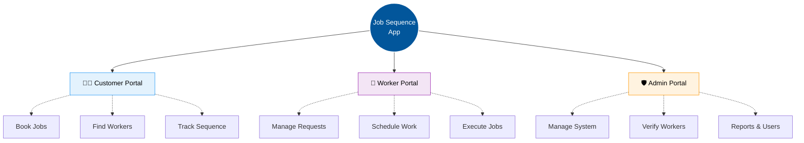
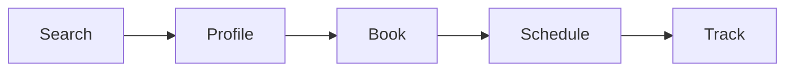
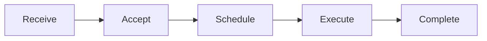

<div align="center">

# 🛠️ Job Sequence App

**A modern Flutter prototype for Customer ↔ Worker ↔ Admin job sequencing**

*Plan jobs. Connect workers. Track execution. Manage everything from one place.*

[](https://github.com/Dhodiapreet/job-sequence-app)
[](https://flutter.dev/)
[](https://dart.dev/)
[](#-current-project-status)

</div>

---

## 📖 About the Project

**Job Sequence App** is a Flutter-based job management and sequencing prototype designed around three core ecosystems:

*   🧑‍💼 **Customer** — Discover workers, create bookings, schedule jobs, and track sequences.
*   👷 **Job Seeker / Worker** — Receive job requests, manage schedules, and execute assigned jobs.
*   🛡️ **Admin** — Manage customers, workers, jobs, bookings, verification, and reports.

> **Note:** We are currently in Phase 2: Integrating Supabase (PostgreSQL + Auth) into our completed UI Prototype.

---

## ✨ Highlights

| Area | What is included |
| :--- | :--- |
| 🎨 **UI** | Material 3 responsive interface with clean aesthetics. |
| 👥 **Roles** | Segregated Customer, Worker & Admin portals. |
| 🧭 **Navigation** | Complete multi-screen navigation flows and state management. |
| 🗓️ **Job Sequencing** | Booking, scheduling, and execution workflow screens. |
| 🔔 **Notifications** | Role-specific notification screens and interactive alerts. |
| ✅ **Execution** | Interactive checklist & photo-upload UI for workers. |
| 💳 **Payments** | Prototype payment checkout and escrow wallet screens. |
| 🧪 **Testing** | Static Flutter analysis + 100% passing widget tests. |
| 🏗️ **Architecture** | Scalable, feature-oriented Flutter directory structure. |
| 📊 **Data** | Highly realistic mock blue-collar job data mapping. |

---

## 🏗️ Application Structure



---

## 🧑‍💼 Customer Portal
The Customer portal provides the complete customer-side job booking experience.

**Main Screens:**
Dashboard • Worker Search • Worker List • Worker Profile • Booking Flow • Date & Time Selection • Sequence View • Bookings List • Booking Details • Project Details • Notifications • Profile • Settings

**Typical Flow:**


## 👷 Worker Portal
Workers can efficiently manage incoming requests, their daily schedules, and live job execution.

**Main Screens:**
Dashboard • Job Requests • Schedule / Calendar • Job Execution • Notifications • Earnings • Profile

**Typical Flow:**


## 🛡️ Admin Portal
The Admin portal provides comprehensive system-level management and oversight.

**Main Screens:**
Dashboard • Workers • Customers • Jobs • Bookings • Worker Verification • Categories • Reports • Notifications • Profile • Settings

**Capabilities:**
Verify workers • Manage customers & workers • Review jobs & bookings • Analyze reports • Manage service categories

---

## 🎨 UI / UX Design System

The application strictly follows a clean **Material 3** design approach with:
*   📱 **Responsive layouts** adapting safely to device constraints.
*   🗂️ **Reusable cards** and stylized containers.
*   🧭 **Bottom navigation** preserving isolated tab states.
*   📑 **App bars and drawers** for deeper navigation trees.
*   🪟 **Modal bottom sheets & Dialogs** replacing dead-ends with interactivity.
*   🏷️ **Status badges** and contextual iconography.

*The prototype is specifically structured so that all main flows remain 100% usable during live demonstrations without crashing.*

---

## 📂 Project Architecture

```text
lib/
├── core/
│   ├── theme/           # AppTheme, AppColors, text styles
│   ├── widgets/         # Reusable global UI components
│   ├── models/          # Data models
│   └── mock_data/       # Static prototype data
│
├── features/
│   ├── customer/
│   │   └── screens/     # Customer-specific UI views
│   ├── worker/
│   │   └── screens/     # Worker-specific UI views
│   └── admin/
│       └── screens/     # Admin-specific UI views
│
└── main.dart            # App entry point & routing
```
*A feature-oriented structure keeps domain logic separated and highly maintainable.*

---

## 💻 Tech Stack

| Technology | Purpose |
| :--- | :--- |
| **Flutter** | Cross-platform UI application framework |
| **Dart** | Core programming language |
| **Material 3** | Standardized UI design system |
| **Cupertino Icons** | iOS-style generic icons |
| **Google Fonts** | Dynamic, beautiful typography |

**Dependencies (`pubspec.yaml`):**
```yaml
dependencies:
  flutter:
    sdk: flutter
  cupertino_icons: ^1.0.8
  google_fonts: ^8.2.1
  intl: ^0.20.3
```

---

## 🚀 Getting Started

### 1. Prerequisites
*   [Flutter SDK](https://docs.flutter.dev/get-started/install) installed
*   Dart SDK (included with Flutter)
*   Chrome (for web execution) or a configured emulator/device.

```bash
# Verify your installation
flutter doctor
```

### 2. Clone the Repository
```bash
git clone https://github.com/Dhodiapreet/job-sequence-app.git
cd job-sequence-app
```

### 3. Install Dependencies
```bash
flutter pub get
```

### 4. Run the Application
```bash
# Run in Chrome (Recommended for Prototype)
flutter run -d chrome

# Run on Windows Desktop
flutter run -d windows

# View all available devices
flutter devices
```

---

## 🧪 Testing

Run static analysis to ensure code quality:
```bash
flutter analyze
# Expected: No issues found!
```

Execute the widget test suite:
```bash
flutter test
# Expected: All tests passed!
```

---

## ✅ Current Project Status

**UI Milestone — 🟢 Completed**

- [x] Customer portal navigation
- [x] Worker portal navigation
- [x] Admin management screens
- [x] Job booking flow & sequence UI
- [x] Date/time selection interfaces
- [x] Worker request (Accept/Decline) actions
- [x] Job execution interactive checklist
- [x] Role-specific Notifications
- [x] Interactive dialogs & bottom sheets
- [x] Dead-end interaction cleanup
- [x] Flutter analysis & unit tests

### ⚠️ Current Prototype Limitations
This version intentionally focuses on the frontend experience. The following are **not implemented yet**:
*   *Real authentication & authorization*
*   *Database persistence*
*   *Backend APIs*
*   *Real-time chat & WebSocket connections*
*   *Live payment processing gateways*

*(Changes made in the app are bound to static mock data and will reset upon application restart).*

---

## 🛣️ Roadmap


**Planned Phases:**
1. Build robust Backend APIs.
2. Add JWT Authentication & Role-based Authorization.
3. Integrate Database persistence (PostgreSQL/Firebase).
4. Connect real customer/worker data.
5. Implement real-time WebSocket messaging.
6. Integrate payment gateways (Stripe/Razorpay).
7. Deploy production builds.

---

## 🤝 Contributing

Contributions, suggestions, and improvements are highly welcome!

```bash
# 1. Create a feature branch
git checkout -b feature/amazing-feature

# 2. Make your changes and stage them
git add .

# 3. Commit with a descriptive message
git commit -m "feat: add amazing feature"

# 4. Push to your branch
git push origin feature/amazing-feature
```
*Then open a Pull Request!*

---

## 📄 License
This project is currently intended as an educational and structural prototype project. A formal open-source license will be established when the project is ready for public backend integration.

<div align="center">
  <br/>
  <h3>🛠️ Job Sequence App</h3>
  <p><i>Built with Flutter • Designed for real-world job sequencing</i></p>
  <p>⭐ If you find this project useful, consider starring the repository!</p>
</div>

## 🚀 Progress Update (Phase 2A - Supabase Foundation)

We have successfully completed the foundational setup for our remote Supabase Database! 

* **Supabase Client Configured**: The Flutter app is successfully linked to the remote Supabase project.
* **PostgreSQL Schema Defined**: Generated robust SQL migrations defining profiles, ookings, worker_availability, and job_sequence_items.
* **Row-Level Security (RLS)**: Enforced strict zero-trust security policies allowing Customers, Workers, and Admins to only access their respective data.
* **State Machine Triggers**: Added PostgreSQL-native functions (alidate_booking_status_transition) to prevent unauthorized booking updates.
* **Double Booking Prevention**: Enforced time-based EXCLUDE USING gist constraints on the worker schedules, smartly allowing cancelled slots to be reused.

**Next Steps (Phase 2B & 2C):**
* Apply the SQL migrations to the live Supabase project.
* Replace mock authentication with Supabase.instance.client.auth.
* Bind the interactive UI Dashboards directly to the Supabase data models.
