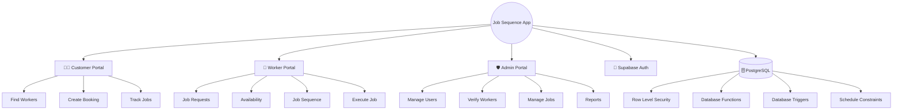
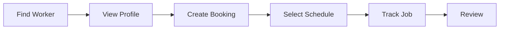
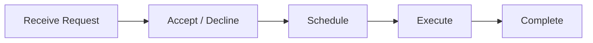
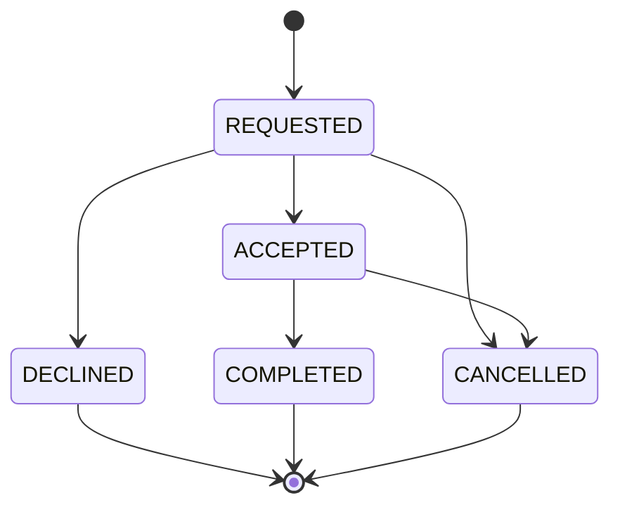
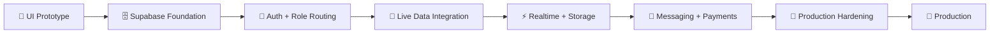

<div align="center">

# 🛠️ Job Sequence App

**A Flutter-based job management and sequencing platform for Customer ↔ Worker ↔ Admin workflows**

*Discover workers. Book jobs. Manage schedules. Execute work. Manage the platform.*

[](https://github.com/Dhodiapreet/job-sequence-app)
[](https://flutter.dev/)
[](https://dart.dev/)
[](https://supabase.com/)
[](#-current-project-status)

</div>

---

## 📖 About the Project

**Job Sequence App** is a Flutter-based job management and sequencing platform designed around three core ecosystems:

- 🧑‍💼 **Customer** — Discover workers, create jobs and bookings, select schedules, and track work.
- 👷 **Worker** — Manage profile and availability, receive job requests, schedule assigned work, and execute jobs.
- 🛡️ **Admin** — Manage users, workers, jobs, bookings, verification, categories, notifications, and reports.

The project has progressed beyond the initial UI prototype.

The current implementation includes a **deployed and verified Supabase backend foundation** with:

- PostgreSQL database schema
- Supabase Email Authentication
- Row-Level Security (RLS)
- Database security functions
- Booking state-machine validation
- Booking schedule synchronization
- Worker schedule conflict prevention
- Database constraints and indexes
- Development Customer, Worker, and Admin accounts

The next major milestone is connecting the existing Flutter UI completely to the live Supabase data layer.

---

# ✨ Features

| Area | Current Status |
|---|---|
| 🎨 UI/UX | Material 3 responsive interface |
| 👥 Roles | Customer, Worker, Admin |
| 🧭 Navigation | Role-specific multi-screen navigation |
| 🗓️ Job Sequencing | Database model and UI foundation |
| 🔐 Authentication | Supabase Email Auth configured |
| 🛡️ Authorization | PostgreSQL RLS and role protection |
| 🗄️ Database | Supabase PostgreSQL deployed |
| ⚙️ Database Logic | Functions and triggers implemented |
| 🚫 Double Booking | PostgreSQL exclusion constraints |
| 🔔 Notifications | UI/database foundation |
| 📸 Job Execution | Checklist and photo-upload UI |
| 💳 Payments | Prototype UI only |
| 🧪 Testing | Flutter analysis/tests + database verification |
| 🏗️ Architecture | Feature-oriented Flutter structure |

---

# 🏗️ Application Architecture



---

# 🧑‍💼 Customer Portal

The Customer portal provides the customer-side discovery, booking, scheduling, and tracking experience.

### Main Screens

- Dashboard
- Worker Search
- Worker List
- Worker Profile
- Booking Flow
- Date & Time Selection
- Sequence View
- Bookings
- Booking Details
- Project Details
- Notifications
- Profile
- Settings

### Customer Flow



---

# 👷 Worker Portal

Workers can manage requests, availability, schedules, assigned jobs, and job execution.

### Main Screens

- Dashboard
- Job Requests
- Schedule / Calendar
- Job Execution
- Notifications
- Earnings
- Profile

### Worker Flow



---

# 🛡️ Admin Portal

The Admin portal provides system-level management and oversight.

### Main Screens

- Dashboard
- Workers
- Customers
- Jobs
- Bookings
- Worker Verification
- Categories
- Reports
- Notifications
- Profile
- Settings

### Admin Capabilities

- Manage customers
- Manage workers
- Review jobs
- Review bookings
- Verify workers
- Manage service categories
- Review reports
- Manage platform-level data

---

# 🎨 UI / UX Design System

The application follows a clean **Material 3** design approach.

### Design principles

- 📱 Responsive layouts
- 🗂️ Reusable cards and components
- 🧭 Bottom navigation
- 📑 App bars and navigation drawers
- 🪟 Dialogs and modal bottom sheets
- 🏷️ Status badges
- ♻️ Reusable role-specific components
- 🎯 Consistent typography and spacing

The existing UI remains usable for demonstrations while live backend integration is being completed.

---

# 📂 Project Structure

```text
job-sequence-app/
│
├── android/
├── ios/
├── linux/
├── macos/
├── web/
├── windows/
│
├── lib/
│   │
│   ├── core/
│   │   ├── theme/
│   │   ├── widgets/
│   │   ├── models/
│   │   ├── mock_data/
│   │   └── services/
│   │       └── supabase_service.dart
│   │
│   ├── features/
│   │   ├── customer/
│   │   │   └── screens/
│   │   │
│   │   ├── worker/
│   │   │   └── screens/
│   │   │
│   │   └── admin/
│   │       └── screens/
│   │
│   └── main.dart
│
├── supabase/
│   ├── migrations/
│   │   ├── 001_initial_schema.sql
│   │   ├── 002_rls_policies.sql
│   │   ├── 003_security_and_v1_corrections.sql
│   │   └── 004_booking_state_and_schedule_corrections.sql
│   │
│   └── .temp/
│
├── test/
│
├── .env.example
├── .gitignore
├── analysis_options.yaml
├── pubspec.yaml
├── pubspec.lock
└── README.md
```

> The project uses a feature-oriented Flutter structure while Supabase migrations keep database changes version-controlled.

---

# 🗄️ Supabase Backend

The backend uses:

- **Supabase PostgreSQL**
- **Supabase Auth**
- **PostgreSQL RLS**
- **PostgreSQL Functions**
- **PostgreSQL Triggers**
- **PostgreSQL Constraints**

## Core Database Tables

```text
profiles
customer_profiles
worker_profiles
worker_skills
service_categories
worker_availability
jobs
job_sequence_items
bookings
reviews
notifications
worker_verifications
```

---

# 🔐 Database Security

The database foundation includes:

- Row-Level Security (RLS)
- Explicit role-based policies
- Profile role protection
- Booking financial-field protection
- Admin helper function
- Booking state transition validation
- Booking schedule synchronization
- Foreign-key constraints
- Check constraints
- Unique constraints
- Schedule-overlap protection

The database is responsible for enforcing important business rules instead of relying only on Flutter UI validation.

---

# 📅 Booking State Machine

The current booking states are:

```text
REQUESTED
ACCEPTED
DECLINED
COMPLETED
CANCELLED
```

Allowed transitions:



Terminal booking states cannot be changed by normal application users.

---

# 🚫 Double Booking Prevention

Worker scheduling is protected at the PostgreSQL level.

The database contains exclusion constraints for:

```text
worker_availability
job_sequence_items
```

Specifically:

```text
exclude_overlapping_availability
exclude_overlapping_sequence_items
```

This prevents conflicting time ranges for the same worker.

Example:

```text
Worker A

10:00 ───────── 12:00
       Job A

11:00 ───────── 13:00
       Job B
```

The database will reject the overlapping schedule.

This protection does not depend only on Flutter validation.

---

# 🔐 Supabase Authentication

Supabase Email Authentication is configured.

Development test accounts:

```text
admin.test@example.com     → ADMIN
customer.test@example.com  → CUSTOMER
worker.test@example.com    → WORKER
```

These accounts are for development/testing only.

New Supabase Auth users are connected to:

```text
auth.users
     ↓
handle_new_user()
     ↓
public.profiles
```

New users receive the default `CUSTOMER` role.

Role escalation is protected by the database.

---

# 🧪 Database Verification

The remote Supabase database has been verified for:

- [x] Application tables
- [x] ENUM types
- [x] RLS enabled
- [x] RLS policies
- [x] Security functions
- [x] Database triggers
- [x] Primary keys
- [x] Foreign keys
- [x] Check constraints
- [x] Exclusion constraints
- [x] Booking state machine
- [x] Schedule conflict protection
- [x] Supabase Auth test users
- [x] Auth → `profiles` trigger

---

# 💻 Technology Stack

| Technology | Purpose |
|---|---|
| Flutter | Cross-platform application framework |
| Dart | Programming language |
| Material 3 | UI design system |
| Supabase | Backend platform |
| PostgreSQL | Relational database |
| Supabase Auth | Authentication |
| PostgreSQL RLS | Authorization |
| Google Fonts | Typography |
| Intl | Formatting/localization |
| Cupertino Icons | Icon library |
| `supabase_flutter` | Supabase Flutter SDK |
| `flutter_dotenv` | Environment configuration |

---

# 📦 Dependencies

The important backend-related dependencies are:

```yaml
dependencies:
  flutter:
    sdk: flutter

  cupertino_icons: ^1.0.8
  google_fonts: ^8.2.1
  intl: ^0.20.3
  supabase_flutter: ^2.6.0
  flutter_dotenv: ^5.1.0
```

> Keep the exact dependency versions synchronized with `pubspec.yaml`.

---

# 🔑 Environment Configuration

Supabase credentials must not be hardcoded in source code.

Create a local `.env` file based on `.env.example`:

```env
SUPABASE_URL=your_supabase_project_url
SUPABASE_PUBLISHABLE_KEY=your_supabase_publishable_key
```

The `.env` file must remain ignored by Git.

### Important Security Rule

Never put a Supabase `service_role` key inside the Flutter application.

The Flutter application should use the public/publishable key while PostgreSQL RLS enforces database access.

---

# 🚀 Getting Started

## 1. Prerequisites

Install:

- Flutter SDK
- Dart SDK
- Chrome or another supported Flutter device
- Supabase project for live backend functionality

Verify Flutter:

```bash
flutter doctor
```

---

## 2. Clone Repository

```bash
git clone https://github.com/Dhodiapreet/job-sequence-app.git
cd job-sequence-app
```

---

## 3. Install Dependencies

```bash
flutter pub get
```

---

## 4. Configure Environment

Create:

```text
.env
```

using:

```text
.env.example
```

Configure:

```env
SUPABASE_URL=your_supabase_project_url
SUPABASE_PUBLISHABLE_KEY=your_supabase_publishable_key
```

Do not commit `.env`.

---

## 5. Run Application

### Chrome

```bash
flutter run -d chrome
```

### Windows

```bash
flutter run -d windows
```

### List devices

```bash
flutter devices
```

---

# 🧪 Testing

## Flutter Static Analysis

```bash
flutter analyze
```

Expected:

```text
No issues found!
```

## Flutter Tests

```bash
flutter test
```

Expected:

```text
All tests passed!
```

---

# 🚦 Current Project Status

## Phase 1 — UI Prototype

### Status: 🟢 Completed

- [x] Customer portal
- [x] Worker portal
- [x] Admin portal
- [x] Multi-screen navigation
- [x] Booking UI
- [x] Job sequencing UI
- [x] Worker request actions
- [x] Job execution checklist UI
- [x] Notifications UI
- [x] Dialogs and bottom sheets
- [x] Responsive Material 3 interface
- [x] Mock-data demonstration flows

---

# Phase 2A — Supabase Foundation

### Status: 🟢 Completed

- [x] Supabase Flutter dependency
- [x] Supabase client service
- [x] Environment configuration structure
- [x] PostgreSQL schema
- [x] RLS policies
- [x] Security functions
- [x] Booking state-machine triggers
- [x] Schedule synchronization
- [x] Double-booking prevention
- [x] Database constraints
- [x] Database indexes
- [x] Remote database deployment
- [x] Database verification
- [x] Supabase Email Auth
- [x] Customer test account
- [x] Worker test account
- [x] Admin test account
- [x] Auth → `profiles` trigger verification

---

# Phase 2B — Live Flutter Integration

### Status: 🔵 In Progress

- [ ] Connect Login UI to Supabase Auth
- [ ] Connect Signup UI to Supabase Auth
- [ ] Implement session restoration
- [ ] Implement logout
- [ ] Read user role from `profiles`
- [ ] Implement role-based routing
- [ ] Add repository/data-access layer
- [ ] Replace Customer mock data
- [ ] Replace Worker mock data
- [ ] Replace Admin mock data
- [ ] Connect booking creation
- [ ] Connect booking status updates
- [ ] Connect worker availability
- [ ] Connect job sequencing
- [ ] Connect notifications

---

# Phase 2C — Additional Platform Features

### Status: ⚪ Planned

- [ ] Supabase Storage
- [ ] Worker document uploads
- [ ] Job photo uploads
- [ ] Realtime updates
- [ ] Production notifications
- [ ] Reviews and ratings persistence
- [ ] Messaging/chat
- [ ] Payment gateway
- [ ] Dispute workflows
- [ ] Advanced reporting

---

# Phase 3 — Production Hardening

### Status: ⚪ Planned

- [ ] End-to-end testing
- [ ] Security audit
- [ ] Performance testing
- [ ] Loading states
- [ ] Error states
- [ ] Empty states
- [ ] Logging
- [ ] Monitoring
- [ ] Production configuration
- [ ] Deployment

---

# ⚠️ Current Limitations

The following parts are **not yet fully live**:

- Most existing UI flows still use mock/static data.
- Flutter Login/Signup is not yet completely connected to Supabase Auth.
- Role-based Flutter routing is not yet implemented completely.
- Live repositories for Customer, Worker, and Admin data are still being implemented.
- Realtime messaging is not implemented.
- Production push notifications are not implemented.
- Real payment processing is not implemented.
- Production file/image storage integration is not complete.

Therefore, the current project should be described as:

> **A Flutter application with a deployed and verified Supabase backend foundation, with live Flutter data integration currently in progress.**

It should **not** yet be described as a fully production-ready application.

---

# 🛣️ Roadmap



## Development Priorities

1. Connect Flutter authentication to Supabase Auth.
2. Implement session handling.
3. Implement role-based routing.
4. Create repository/data-access layer.
5. Replace Customer mock data.
6. Replace Worker mock data.
7. Connect job sequencing.
8. Replace Admin mock data.
9. Add Storage and realtime functionality.
10. Add notifications, messaging, and payments.
11. Perform security and end-to-end testing.
12. Prepare production deployment.

---

# 🤝 Contributing

Create a feature branch:

```bash
git checkout -b feature/amazing-feature
```

Stage changes:

```bash
git add .
```

Commit:

```bash
git commit -m "feat: add amazing feature"
```

Push:

```bash
git push origin feature/amazing-feature
```

Then open a Pull Request.

---

# 📄 License

This project is currently intended for educational and project-development purposes.

A formal open-source license can be added when the project is ready for public distribution.

---

<div align="center">

### 🛠️ Job Sequence App

**Built with Flutter • Powered by Supabase • Designed for real-world job sequencing**

⭐ If you find this project useful, consider starring the repository!

</div>
