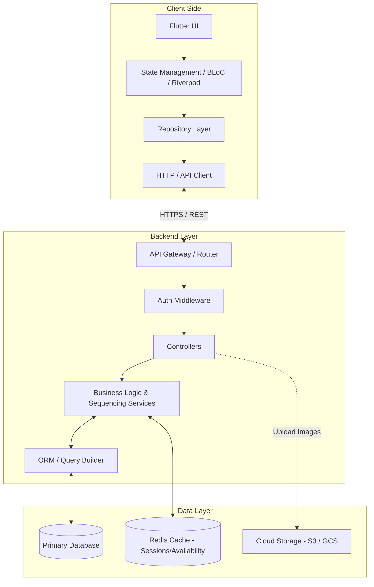

# Backend & Database Architecture Proposal
**Project:** Job Sequence App
**Platform:** Flutter / Dart (Frontend) | **Phase:** 2 (Architecture Design)

---

## 1. Data Dictionary & Entities

The following schemas outline the data layer. In a relational database, these map to tables; in NoSQL, they map to collections/documents.

### 1. User
The base identity for all roles.
*   **Fields:**
    *   `id` (String/UUID, PK) - Primary Identifier
    *   `email` (String, Required) - Indexed, Unique
    *   `phoneNumber` (String, Optional) - Indexed, Unique
    *   `role` (Enum: `CUSTOMER`, `WORKER`, `ADMIN`, Required)
    *   `status` (Enum: `ACTIVE`, `SUSPENDED`, `BANNED`, Required)
    *   `createdAt`, `updatedAt` (DateTime, Required)
*   **Relationships:** 1-to-1 with Customer, Worker, or Admin profiles.

### 2. Customer Profile
*   **Fields:**
    *   `userId` (String, PK & FK to User)
    *   `fullName` (String, Required)
    *   `avatarUrl` (String, Optional)
    *   `stripeCustomerId` (String, Optional) - For payment processing
    *   `totalJobsBooked` (Int, Required, Default: 0)
    *   `averageRating` (Float, Required, Default: 5.0)

### 3. Worker Profile
*   **Fields:**
    *   `userId` (String, PK & FK to User)
    *   `fullName` (String, Required)
    *   `trade` (String, Required)
    *   `categoryId` (String, FK to ServiceCategory) - Indexed
    *   `hourlyRate`, `dailyRate` (Decimal, Required)
    *   `rating` (Float, Required, Default: 0.0)
    *   `reviewsCount` (Int, Required, Default: 0)
    *   `jobsCompleted` (Int, Required, Default: 0)
    *   `bio` (String, Optional)
    *   `safetyScore` (Int, Required, Default: 100)
    *   `isAcceptingJobs` (Boolean, Required, Default: true)
*   **Validation Rules:** `hourlyRate` > 0.

### 4. Admin Profile
*   **Fields:**
    *   `userId` (String, PK & FK to User)
    *   `fullName` (String, Required)
    *   `adminLevel` (Enum: `SUPER_ADMIN`, `SUPPORT`, `DISPUTE_MANAGER`)

### 5. Worker Skills
*   **Fields:**
    *   `id` (String/UUID, PK)
    *   `workerId` (String, FK to Worker) - Indexed
    *   `categoryId` (String, FK to ServiceCategory)
    *   `skillName` (String, Required)
    *   `proficiency` (Enum: `BEGINNER`, `INTERMEDIATE`, `EXPERT`)

### 6. Service Categories
*   **Fields:**
    *   `id` (String/UUID, PK)
    *   `name` (String, Required) - Unique
    *   `iconIdentifier` (String, Required)
    *   `colorCode` (String, Required)
    *   `isActive` (Boolean, Required, Default: true)

### 7. Worker Availability (Time Slots)
*   **Fields:**
    *   `id` (String/UUID, PK)
    *   `workerId` (String, FK to Worker) - Indexed
    *   `date` (Date/String YYYY-MM-DD, Required) - Indexed
    *   `startTime` (Time, Required)
    *   `endTime` (Time, Required)
    *   `status` (Enum: `AVAILABLE`, `BOOKED`, `BLOCKED`, Required)
*   **Validation Rules:** `endTime` > `startTime`. Overlapping slots for the same worker are constrained at the DB level.

### 8. Jobs (Projects)
The overarching project that contains multiple sequenced steps.
*   **Fields:**
    *   `id` (String/UUID, PK)
    *   `customerId` (String, FK to Customer) - Indexed
    *   `title` (String, Required)
    *   `description` (String, Required)
    *   `locationId` (String, FK to Location)
    *   `status` (Enum: `DRAFT`, `PUBLISHED`, `IN_PROGRESS`, `COMPLETED`, `CANCELLED`)
    *   `totalBudget` (Decimal, Required)
    *   `progressPercent` (Float, Required, Default: 0.0)
    *   `createdAt`, `updatedAt` (DateTime, Required)

### 9. Job Sequence (Job Steps)
A specific task within a Job. Forms a Directed Acyclic Graph (DAG).
*   **Fields:**
    *   `id` (String/UUID, PK)
    *   `jobId` (String, FK to Job) - Indexed
    *   `sequenceOrder` (Int, Required)
    *   `categoryId` (String, FK to ServiceCategory)
    *   `dependsOnStepIds` (List<String> / Junction Table in SQL) - Steps that must complete first.
    *   `status` (Enum: `PENDING_PREDECESSOR`, `READY_TO_BOOK`, `BOOKED`, `IN_PROGRESS`, `UNDER_REVIEW`, `COMPLETED`)
    *   `assignedWorkerId` (String, FK to Worker, Optional)
    *   `checklist` (JSON/Array of Strings, Optional)

### 10. Bookings
The contract binding a Worker to a specific Job Step.
*   **Fields:**
    *   `id` (String/UUID, PK)
    *   `stepId` (String, FK to Job Sequence) - Indexed, Unique (1 active booking per step)
    *   `customerId` (String, FK to Customer)
    *   `workerId` (String, FK to Worker) - Indexed
    *   `slotId` (String, FK to Availability)
    *   `status` (Enum: `REQUESTED`, `ACCEPTED`, `DECLINED`, `COMPLETED`, `CANCELLED`)
    *   `laborCost`, `serviceFee`, `totalAmount` (Decimal, Required)
    *   `specialInstructions` (String, Optional)
    *   `createdAt`, `updatedAt` (DateTime, Required)

### 11. Job Status History
Audit log for tracing sequence bottlenecks and disputes.
*   **Fields:**
    *   `id` (String/UUID, PK)
    *   `referenceId` (String, FK to Job or Booking) - Indexed
    *   `oldStatus`, `newStatus` (String, Required)
    *   `changedById` (String, FK to User)
    *   `timestamp` (DateTime, Required)
    *   `note` (String, Optional)

### 12. Reviews and Ratings
*   **Fields:**
    *   `id` (String/UUID, PK)
    *   `bookingId` (String, FK to Booking, Unique) - 1 review per booking direction
    *   `authorId` (String, FK to User)
    *   `targetId` (String, FK to User)
    *   `rating` (Float, Required)
    *   `comment` (String, Optional)
*   **Validation Rules:** `rating` between 1.0 and 5.0.

### 13. Notifications
*   **Fields:**
    *   `id` (String/UUID, PK)
    *   `userId` (String, FK to User) - Indexed
    *   `title`, `message` (String, Required)
    *   `type` (Enum: `SYSTEM`, `BOOKING_UPDATE`, `MESSAGE`)
    *   `referenceId` (String, Optional) - ID of related booking/job
    *   `isRead` (Boolean, Required, Default: false)

### 14. Payments (Escrow Ledger)
*   **Fields:**
    *   `id` (String/UUID, PK)
    *   `bookingId` (String, FK to Booking) - Indexed
    *   `payerId`, `payeeId` (String, FK to User)
    *   `amount` (Decimal, Required)
    *   `stripeChargeId` (String, Optional)
    *   `status` (Enum: `HELD_IN_ESCROW`, `RELEASED_TO_WORKER`, `REFUNDED`)
    *   `createdAt`, `releasedAt` (DateTime)

### 15. Worker Verification
*   **Fields:**
    *   `id` (String/UUID, PK)
    *   `workerId` (String, FK to Worker) - Indexed
    *   `documentType` (Enum: `GOV_ID`, `TRADE_LICENSE`, `INSURANCE`)
    *   `documentUrl` (String, Required)
    *   `status` (Enum: `PENDING`, `APPROVED`, `REJECTED`)
    *   `reviewedById` (String, FK to Admin, Optional)

### 16. Locations
*   **Fields:**
    *   `id` (String/UUID, PK)
    *   `userId` (String, FK to User)
    *   `addressLine1`, `city`, `state`, `zipCode` (String, Required)
    *   `latitude`, `longitude` (Float, Required) - For geospatial queries
    *   `isDefault` (Boolean, Required, Default: false)

---

## 2. Concurrency & Workflow Management

### A. Booking Conflicts (Two customers, same worker/time)
*   **Behavior:** Prevented via **Database Transactions (ACID)**.
*   **Flow:** Customer A initiates checkout. The backend starts a transaction:
    1. Reads `WorkerAvailability` where `status == AVAILABLE`.
    2. If true, updates to `status = BOOKED`.
    3. Writes the `Booking` record.
    4. Commits transaction.
*   Customer B attempting the same exact query simultaneously will be placed in a transaction queue. By the time B's transaction reads the row, `status` is `BOOKED`. B's transaction aborts, returning a "Slot unavailable" error.

### B. Job Sequencing (DAG Resolution)
*   **Behavior:** Sequential unblocking. 
*   **Flow:** Plumber completes the "Rough Plumbing" step.
    1. Worker marks step as `COMPLETED`.
    2. System queries the `JobSequence` table for any steps where `dependsOnStepIds` contains the Plumber's step ID.
    3. For each dependent step (e.g., Drywall Installation), the system evaluates if *all* its dependencies are now `COMPLETED`.
    4. If true, the Drywall step status changes from `PENDING_PREDECESSOR` to `READY_TO_BOOK`.
    5. A push notification is fired to the Customer: "Ready to book Drywaller".

### C. Worker Lifecycle Actions
*   **Worker Accepting a Job:** Validates the booking is still `REQUESTED`, updates to `ACCEPTED`, sends Customer a notification.
*   **Worker Declining:** Updates booking to `DECLINED`. Transactionally reverts the associated `WorkerAvailability` slot back to `AVAILABLE`. Customer is notified to find another worker.
*   **Customer Cancelling:** Reverts `WorkerAvailability` to `AVAILABLE`. Triggers refund logic on the `Payment` ledger (full refund if >24hrs, partial penalty if <24hrs).
*   **Job Completion:** Worker uploads photos -> Step `COMPLETED` -> Sequence resolves (see B) -> Admin/System triggers `Payment` status from `HELD_IN_ESCROW` to `RELEASED_TO_WORKER`.

---

## 3. Application Architecture

---

## 4. Architecture Comparison: Firebase vs REST + SQL

### Option A: Firebase (Firestore, Cloud Functions, Auth)
*   **Pros:**
    *   Rapid development speed (no server infrastructure to manage).
    *   Out-of-the-box real-time updates (Sockets) which is great for Chat and live Sequence tracking.
    *   Seamless Flutter integration (FlutterFire).
*   **Cons:**
    *   **Relational Complexity:** The Job Sequence requires a Directed Acyclic Graph (DAG). Modeling dependencies (`dependsOnStepIds`) and querying them in NoSQL is difficult and requires extensive denormalization or heavy Cloud Function logic.
    *   **Concurrency:** Double-booking prevention requires Firestore Transactions. Firestore has a limit of 1 write per second on a single document, which can cause contention on highly sought-after workers.
    *   **Geospatial Search:** Finding workers within a 15km radius requires third-party tools (GeoFlutterFire) or complex geohash calculations, as Firestore lacks native PostGIS equivalents.

### Option B: Conventional REST + SQL (Node.js/Go/Python + PostgreSQL)
*   **Pros:**
    *   **ACID Transactions:** Perfect for booking conflicts, escrow ledgers, and financial records. Absolute data consistency.
    *   **Relational Integrity:** Foreign keys ensure a booking cannot exist for a deleted worker or a cancelled step.
    *   **Advanced Querying:** SQL handles DAG queries (Recursive CTEs for sequencing) and location queries (PostGIS for "Workers near me") effortlessly.
*   **Cons:**
    *   Requires building, deploying, and managing a backend server.
    *   Real-time chat requires setting up and scaling WebSockets (e.g., Socket.io) manually.

---

## 5. Final Recommendation

**I highly recommend Option B: REST API with PostgreSQL.**

**Why?**
The core value proposition of this application is **Job Sequencing** and **Workforce Booking**. These are inherently relational and highly transactional problems. 
*   If a predecessor job finishes, you need to query and update dependent downstream jobs immediately.
*   You must prevent two customers from booking a worker's 9:00 AM slot.
*   You are handling escrow payments and payouts.

Attempting to force this complex relational integrity into a NoSQL document database (Firestore) will lead to fragile Cloud Functions, orphaned data, and scaling nightmares as the sequence logic grows. 

**Proposed Stack:**
*   **Database:** PostgreSQL (with PostGIS for location features).
*   **Backend:** Node.js (NestJS or Express) OR Go (for high concurrency).
*   **Authentication:** Firebase Auth (Used strictly as an identity provider to pass JWT tokens to your SQL backend, combining the best of both worlds).
*   **Storage:** AWS S3 or Google Cloud Storage for avatars and checklist proofs.
